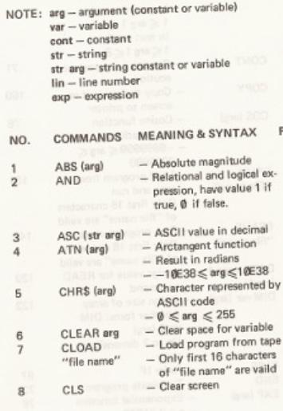

# Laser310-BASIC快速上手

## 1. 电脑

+ 电脑是什么
+ 计算机系统的组成
+ 程序是什么
+ 计算机语言
+ BASIC语言

### 1.1 电脑是什么

电脑是一台能根据使用者给出的指令产生一定行为的机器。电脑无法告诉使用者如何解决问题，相反，使用者需要告诉电脑要做什么。电脑不会思考，但是它在一个有能力、有经验的使用者手里将是一个非常有效的工具。  
一个电脑系统包含众多的，由中央控制单元进行协调的机器与设备。这些部件一起工作时，能进行简单而有逻辑的算数处理，比如比较两个数的大小。它们也能读取、存储信息，并输出我们能直接理解的结果。

### 1.2 计算机系统的组成

一般来说一个计算机系统包含以下单元：

1. 中央处理器 (CPU)  
中央处理器可以被认为是计算机系统中的“大脑”。它能执行指定的指令，如数学运算或逻辑运算。
2. 内置存储单元  
用户给出的或电脑生成的信息与指令被存储在此。此单元在电脑内部，中央处理器从此处直接获取信息。
3. 大容量存储单元  
这个单元在电脑之外，也能存储用户给出的或电脑生成的信息与指令。磁带存储单元和软盘存储单元是大容量存储单元的两个例子。存储在这些地方的信息必须在被中央处理器处理之前被转换进内置存储单元。
4. 输入设备  
如其名，这类设备允许用户向电脑输入指令与信息。举个例子：键盘。
5. 输出设备  
它们接受电脑发出的信息或结果。举例：打印机，电视屏幕。

输入与输出设备共同在用户与计算机系统之间构建了一个双向交流通道。  
尽管计算机系统多种多样，但它们实际上都需要上述单元。


### 1.3 程序是什么

程序是一组指令。为计算机指定一组指令的过程叫做编程。编写程序的人叫做程序员。程序员输入一组指令（即程序），告诉电脑要采取什么操作，从而完成相应的任务。

### 1.4 计算机语言

为计算机编写程序需要两个步骤。首先，程序员需要知道要指定什么指令以及指定指令的顺序。其次，他必须要能够把指令传递给计算机。指令的传递是通过一种编程“语言”完成的，程序员编写，计算机“读取”。  
现如今有许多编程语言正在被使用。某些是为非常专业的应用程序设计的。而另一些为了更普遍用途而设计。BASIC语言属于后者。

### 1.5 BASIC语言

BASIC 是“初学者通用符号指令代码” ( Beginners' All-Purpose Symbolic Instruction Code ) 的缩写，是一个功能强大的编程语言。BASIC语言有一些简单的英语词汇与较少的语法规则，类似于普通的数学符号。要操作你的计算机（ Laser-310 ），你必须懂BASIC语言。我们将逐步地介绍与解释。  
BASIC语言编写的程序经由程序翻译器翻译成中央处理器可以读懂的语言。这个程序翻译器被成为BASIC解释器，它被包含在主控制台中。

## 2. 如何使用你的彩色计算机

+ 启动
+ 如何操作键盘
+ `PRINT` 指令
+ 语法错误
+ 编辑
+ 插入
+ `CLS`
+ 展望

### 2.1 启动

当你设置好你的彩色计算机并且打开开关后，你的电视屏幕应该看起来像这样：

> 下划线代表了方形的、闪烁的光标

```text
VIDEO TECHNOLOGY
BASIC V2.0
READY
_
```

**READY** 告诉你计算机正在等待，顾名思义，它准备好接受你的指令了。那个闪烁的方块，即光标，告诉你你在屏幕上的确切位置。也就是说，你用键盘输入的任何信息都会显示在屏幕上。  
电脑有两种字符显示模式，一种是黑色字符模式，就像你现在在屏幕上看到的那样。另一种是绿色字符模式。字符显示模式可以通过两种方式选择。  
第一种方式非常简单，关闭你的彩色计算机，按住 `CTRL` 不放的同时再次打开计算机。现在你可以在屏幕上看到绿色字符模式了。  
第二种方式是向计算机键入指令。此时，你可能只是一个字一个字地输入命令。稍后你将学习这些命令是如何工作的。  
黑色字符模式可以通过输入这些并按下回车来选择：

```basic
POKE 30744,0
```

绿色字符模式可以通过输入这些并按下回车来选择：

```basic
POKE 30744,1
```

现在试试这些命令看看效果。

### 2.2 如何操作键盘

你电脑的键盘看起来复杂，但是真的不难操作。大多数按键看起来应该像：


大多数键由4个标签（LABEL）组成： LABEL 1-4 。
每个标签都可以用不同的方式输入。

+ LABEL 1 - 直接按下该键就可以
+ LABEL 2 - 同时按下 `SHIFT` 和该键  
图形字符用这种方式输入
+ LABEL 3 - 同时按下 `CTRL` 和该键  
这是功能强大的语句条目，那些颜色相反的标签是那些立即执行但屏幕上没有信息的标签。
+ LABEL 4 - 先同时按下 `CTRL` 和 `RETURN` 键进入 **FUNCTION** 模式，然后同时按 `CTRL` 键与该键。

让我们以 `9` 键为例。要得到数字 **9** 只需要直接按下按键。如果你想得到 **READ** ，在按住 `CTRL` 的同时按 `9` 。如果你想得到 `9` 上的括号，按住 `SHIFT` 的同时按 `9` 。  
要得到 `9` 下面的 **ABS(** ，就有点复杂了。在按住 `CTRL` 的同时先按一下 `RETURN` ，然后按下 `9` 。 **ABS(** 将出现在屏幕上。这需要一点练习。如果你好奇“这样做会发生什么……”，那就去自己尝试一下吧！


### 2.3 `PRINT` 指令

你可以用BASIC语言来控制你的计算机。计算机可以立即执行，也可以将指令存储起来、组织成程序执行。现在我们让计算机立刻执行我们的输入。要做到这些，我们需要BASIC语言中的第一个单词： `PRINT` 。


> 在将 `PRINT` 作为我们第一个BASIC命令时，我们会使用右上角附近的 `RETURN` 键来告诉计算机我们已经输入完了一行指令。这样它就可以执行指令或将其存储。不要将这个按键与BASIC命令 `RETURN` （在 `R` 键上方）混淆，那个命令我们将稍后讨论。

在使用 `PRINT` 或任何其他语句时，你可以键入每个字母。例如 `P` `R` `I` `N` `T` ，也可以按下组合键，此处为 `CTRL` 与 `P` ( `CTRL-P` ) ，来得到关键字。你可以自己在电脑上试一试。

> ( `CTRL-P` ) 代表你同时按下 `CTRL` 与 `P` 。

无论以何种方式键入了 `PRINT` ，电脑都知道它需要打印其后跟随的内容。简单起见，也可以用 `?` 来代替 `PRINT` 指令。  
例如，键入 `PRINT 6-3` 后屏幕看起来是这样的：


注意，当你按下按键时，会有“滴”的一声。这告诉你按键已按下，并且这很有用——你不必经常抬头检查屏幕。  
并且，如果你按住一个（或一些）按键不放，这个（或这些）字符将不停发送到电脑，直到你松开。如果你输入的字符总数达到了64个，重复键功能将停止，这是因为每条语句最多只能包含64个字符。  
现在按下 `RETURN` 并且你的屏幕看起来应该像这样：


通过按下 `RETURN` ，你告诉了计算机消息已输入完成，并且想要这一行执行。记住在每一个完成的消息后按下 `RETURN` 。

### 2.4 语法错误

你或许会看到屏幕上写着 `?SYNTAX ERROR` 。  
这条消息意味着语法错误。它通常由不正确的标点或输入错误引起。  
假设你输入了 `PRIMT 6-3` 然后按下了 `RETURN` ，那么你的屏幕看起来将像这样：


除了语法错误，还可能发生许多其他的错误。各种错误类型在附录中列出。这些错误消息告诉你程序出错的原因。如果你熟悉这些消息，你就可以快速而成功地纠正你的程序。

### 2.5 编辑

如果你在输入语句的时候出现了错误，可以使用 `CTRL` 和适当的键将光标移回错误的地方以进行更正。


+ 首先通过按 ( `CTRL-M` ) 将光标移到 **T** 上。
+ 按下 `ROBOUT` ( `CTRL-;` ) ，此时 **T** 消失。
+ 用 ( `CTRL-M` ) 将光标再次左移到 **M** 上。
+ 再次按下 `ROBOUT` ( `CTRL-;` ) ，此时 **M** 消失。
+ 输入 **NT** 来得到 `PRINT` 。

一般来说，你可以使用光标移动键、 `INSERT` ( `CTRL-L` ) 与 `RUBOUT` ( `CTRL-;` ) 来更正你的程序行。你可以朝着上下左右四个方向移动你的光标。你会在空格键与右下角的一些按键上找到代表四个方向的箭头字符。  
让我们再来举个例子：如果你输入了一行，那么此时光标在你屏幕右侧。我们假设你在这行开头有个输入错误。你想要删除这一行，一直按 ( `CTRL-M` ) 直到光标达到你想要的位置，这个例子里是 **H** 所在的位置。然后按 `RUBOUT` ( `CTRL-;` ) 直到这行被删除。


如果要消除 **JOHN** ，用 ( `CTRL-M` ) 将光标移动到 **J** ，然后一直按着 `RUBOUT` ( `CTRL-;` ) 看看发生了什么。  
也可以用新的字母覆盖原有字母。我们假设你想要把 **JOHN** 换成 **JAMES** ，用 ( `CTRL-M` ) 将光标移动到 **O** ，输入 **AMES** ，你便得到了 **JAMES** 。  
假设你输入 **HELLO JAMES** 后又打算更改名称了，但此时你的光标在更下面的行上。你需要做的就是按 ( `CTRL-.` ) 。你会发现光标会向上跳到你想要更改的那一行去。每按一下 ( `CTRL-.` ) ，光标向上移动一行。移动到想要的那一行后，可以用与之前相同的方式进行修改。  
要熟悉编辑功能，你得多尝试。和其他功能一样，熟能生巧。

### 2.6 插入

这允许你在不改变原有字符的情况下在光标所在位置插入新的字符。举个例子，你想要在 **JOHNTON** 中 **N** 和 **T** 中间插入一个 **S**。  
将光标移动到 **T** 上，按下 `INSERT` ( `CTRL-L` ) （这将使你进入插入模式），然后输入 **S** ，你的显示器看起来像这样：


记得在编辑完成后按下 `RETURN` 。这将更新光标所在的这一行。这在数字标号的程序行中很重要，如果你忘了这么做，原行将依然保存在程序中。

### 2.7 `CLS`

你或许猜到了 `CTRL` 是“控制 (control) ”的意思。  
如果你想清除整块屏幕，按下 `CLS` ( `CTRL-H` ) 然后按下 `RETURN`。这会清除屏幕，但不会清除内存。如果你按下 `NEW` ( `CTRL-8` ) ，程序将被从内存中清理出去。断开电源也会导致内存中的程序清除。

### 2.8 展望

在这个阶段，你可能非常渴望“跳级”，看看你的计算机有什么本领。那么现在，用你新学到的知识，试着输入这些程序。  
小心输入所有内容。不要担心现在看不懂这些内容。

1. 要得到屏幕上能显示的所有字符，输入这些：  

    ```basic
    10 FOR I=0 TO 1
    20 FOR J=0 TO 255
    30 POKE 28672+I*256+J,J
    40 NEXT
    50 NEXT
    60 GOTO 60
    ```  

    输入完成后输入 `RUN` 来运行，运行时输入 `BREAK` ( `CTRL--` ) 停止。

2. 想看彩色能力，试试这个：

    ```basic
    10 MODE(1)
    20 FOR Y=0 TO 15
    30 FOR X=1 TO 4
    40 COLOR X
    50 FOR K=0 TO 31
    60 SET(X*32-32+K,Y)
    70 NEXT
    80 NEXT
    90 NEXT
    100 GOTO 10
    ```

    输入完成后输入 `RUN` 来运行，运行时输入 `BREAK` ( `CTRL--` ) 回到字符模式。

## 3. 把你的彩色计算机当作一个简单计算器

+ 简单指令
+ 数字运算顺序
+ 括号

### 3.1 简单指令

要将计算机作为一个简单的计算器，只需输入 `PRINT` ，后面跟上你的问题，然后按下 `RETURN` 。你的计算机当然不只能用 **+** 计算加法，也能用 **-** 计算减法、用 **\*** 计算乘法、甚至用 **^** 计算乘方。这些符号称为运算符，他们在操作数上进行运算。

> **^** 为 ( `SHIFT-N` )

举例：

```basic
PRINT 3^2
```

然后会输出答案9。

### 3.2 数字运算顺序

进行复合运算时，必须注意计算机进行运算的顺序。顺序如下：

1. 负号用于表示负数
2. 幂运算从左向右计算
3. 乘除法（被赋予相同序次的）从左到右计算
4. 加减法从左到右计算

举例：

1. 输入

    ```basic
    PRINT 3^2^2^2
    ```

    输出

    ```basic
    6561
    ```

    先计算3的二次方得9，然后是9的二次方得81，然后是81的二次方得6561。
2. 输入

    ```basic
    PRINT 6*2+3
    ```

    先计算6乘2，再将结果加3。
3. 输入

    ```basic
    PRINT 6+3*4+6/3
    ```

    输出

    ```basic
    20
    ```

    先计算乘除，后计算加减，即6加12加2。

### 3.3 括号

括号内的操作优先于其它操作计算。举例：  
输入

```basic
PRINT 18/(3+3)
```

输出

```basic
3
```

括号嵌套时，最里面的括号先计算。举例：  
输入

```basic
PRINT 20/(1+(3^2))
```

输出

```basic
2
```

## 4. 常量和变量

+ 常量
+ 变量
+ 赋值
+ 分号和逗号
+ 冒号

### 4.1 常量

前面几章的内容中我们一直在使用常量。常量，顾名思义，一个不变的量，可以是正的也可以是负的。*6.32* 是一个常量，移动到 *6.33* 也只是给出了另一个常量。  
这个电脑中数字的范围是 *-10^30 <= X <= 10^30* 。最小的正数为 *10^(-30)* 。

> 这个范围存疑。根据技术文档，数字以单精度浮点存储。

### 4.2 变量

变量，正如你可能猜测的，是会变化的值。在 *Y=X+3* 中， *X* 和 *Y* 都有很多可能的值，所以他们都是变量。变量可以用字母表中的任意一个字母或两个字母表示，也可以用一个字母和一个数字表示，只要字母在前。比如 *A* , *AB* , *A6* 。  
变量名可以是任意长度的，但是计算机只能识别前两个字符。举个例子，计算机认为 *HELLO* 和 *HE* 是同一个变量。  
变量名不能包含 `LET` `PRINT` 等命令词。总共有三种类型的变量：

1. 实数 - 可以有小数，例如 `A=3.5` 或 `A=1E3` 。
2. 整型 - 不能有小数，例如 `A%=3` 。
3. 字符串 - 包含一串字符，例如 `A$="ABCD"` 。

### 4.3 赋值

`LET` 命令可以用于给变量赋一个值。没有被赋值的变量会等于 0 。变量会保存被赋予的值，直到另一个 `LET` ， `READ` 或 `INPUT` 指令改变了它的值。  
举例输入：

```basic
LET A=7
LET B=9
PRINT A+B
```

输出：

```basic
16
```

在BASIC语言中等于号与通常的意思不同。在这里它告诉电脑左边的变量与右边的值相等。  
语句的左侧必须是变量。我们来看下一个例子：  
输入

```basic
LET A=2
LET B=3
LET C=20
LET A=2+A
LET D=3+D
PRINT A;B;C;D
```

输出

```basic
 4 3 20 3
```

在第四行我们看到 **A** 被赋了一个新值，这个值是 2 加上 **A** 的旧值 2 。所以新值为 4 。  
第五行我们看到 **D** 的值被赋为 3 加上 **D** 。任何没有被赋值过的变量都以 0 为默认值。不过预定义所有变量是一个好习惯。  
注意在你的计算机中并不严格要求使用 `LET` 来赋值变量。 `A=7` 的效果和 `LET A=7` 是一样的。

### 4.4 分号和逗号

如果 `PRINT` 语句包含了超过一个项，那么这些项应该用逗号或分号隔开。注意之前的举例中 `PRINT` 语句的用法，这将导致结果紧凑打印，并为数字的符号留出一个空格。用分号分隔字符串时，之间将没有空格。  
逗号导致的打印结果如下：把你的屏幕分成两个部分，每一个部分 16 个字符。逗号将使你的第一个结果打印在第一块区域的开头——左侧——第二个结果打印在第二块区域的开头。第三个结果将从下一行的第一个区域开始打印。如果一个结果的长度大于 16 字符，那么它将重叠到下一个区域中。下一个结果将跳过那个区域，从再下一个区域的开头开始输出。

### 4.5 冒号

如果你在一行中写了多条语句，你必须用冒号分隔他们。  
举例输入：

```basic
10 FOR I=1 TO 5:PRINT I;:NEXT
```

运行输出：

```basic
 1 2 3 4 5
```

#### `PRINT` 语句列表

举例：

```basic
10 PRINT 4
20 PRINT 6
30 PRINT 8
```

运行后你将得到：

```basic
4
6
8
```

#### `PRINT` 语句后有分号

举例：

```basic
10 PRINT 4;
20 PRINT 5;
30 PRINT 6;
```

运行后你将得到：

```basic
 4 5 6
```

总的来说， `PRINT` 语句后的分号告诉计算机输出的时候不要新起一行。

## 5. 编程

+ `REM`
+ `INPUT`
+ `NEW`
+ `RUN`
+ `LIST`
+ 列出时暂停
+ 删除一行

### 5.0 编程

好，现在让我们尝试一些简单的编程。前几章中我们一直在和“立即执行”打交道——计算机立即处理我们的输入。现在我们希望计算机能够储存一些语句，这样我们就可以在“延期执行”中使用他们。  
看看这个程序：

```basic
10 REM RAISE TO THE POWER OF 3
20 INPUT A
30 PRINT A;A^3
```

注意到每一行以一个数字开头。这些数字告诉计算机不要立刻执行，而是将他们存储起来。行号控制该行在屏幕上出现的顺序。用 10 的间隔来写行号是很有用的，这样新的行可以通过给他们编号 15 或 25 来填进程序的任何部分。行号允许的范围是 0 到 65529 。

### 5.1 `REM`

之前例子中第 10 行的 `REM` 只是提醒你程序的用途。计算机将忽略任何以 `REM` 开头的行，但是 `REM` 语句占用内存空间。如果你缺少空间，可以删除 `REM` 语句。

### 5.2 `INPUT`

第 20 行的 `INPUT` 要求你为变量 **A** 赋值。当你执行这段程序时，一个问号将被显示。计算机将等待你键入一个值，并将这个值赋予变量 **A** 。

### 5.3 `NEW`

那么我们要怎么把程序输入进计算机？首先我们需要输入 `NEW` 指令然后按下回车。这将清除任何旧程序与变量。记住 `NEW` 指令清除计算机的内存。  
现在输入：

```basic
10 REM RAISE TO THE POWER OF 3
20 INPUT A
30 PRINT A;A^3
```

你可以通过输入 `RUN` 后按下回车来执行程序。问号将出现在 `RUN` 之下。这是 `INPUT` 语句的结果，并且计算机现在正在等待你给出一个赋给变量 **A** 的值。这个值应在问号后被输入。  
让我们输入 2 并回车。  
屏幕看起来像这样：

```basic
10 REM RAISE TO THE POWER OF 3
20 INPUT A
30 PRINT A;A^3
RUN
? 2
 2 8
```

### 5.4 `RUN`

在输入 `RUN` 并按下回车之后，你存储的整个程序将按行号从小到大被执行。但是如果你输入 `RUN` ( `CTRL-6` ) 并在回车前输入行号，程序将从指定行号开始执行。  
现在看看这个程序：

```basic
10 INPUT A,B
20 PRINT A+B
```

你将得到一个问号的提示符来输入第一个值，然后是两个问号的提示符来输入第二个值。执行上述程序，屏幕看起来像这样：

```basic
10 INPUT A,B
20 PRINT A+B
RUN
?  3
??  6
    9
```

一个 `INPUT` 指令将只允许两行变量输入。不过，如果用逗号结束每个值，而不是使用回车键，则可以通过单个 `INPUT` 命令输入多于两个变量的值。

### 5.5 `LIST`

如果你想要整个程序以行号递增的方式排列显示，只需输入 `LIST` 然后回车。  
输入案例：

```basic
10 INPUT A
20 INPUT B
30 PRINT A;B;C;A+B+C
25 INPUT C
LIST
```

输出：

```basic
10 INPUT A
20 INPUT B
25 INPUT C
30 PRINT A;B;C;A+B+C
```

如果你想要显示某一行，在 `LIST` 后加上行号。 `LIST 20` 的结果是 `20 INPUT B`。  
如果你想要查看一段程序，比如 20-30 行，输入 `LIST 20-30` 。以下是输出：

```basic
20 INPUT B
25 INPUT C
30 PRINT A;B;C;A+B+C
```

如果输入 `LIST -30` 将得到从头到 30 行的程序。  
如果输入 `LIST 30-` 将得到 30 行到末尾的程序。

### 5.6 列出时暂停

如果你有一个非常长的程序，并且想要在列出程序的时候看看某些特殊的行，只要在你想要停下的时候按一下空格键。再按一下恢复列出。

### 5.7 删除一行

要删除一行，只要输入行号并按下回车。

## 6. 计算机编程回顾

+ `GOTO`
+ **BREAK**
+ `CONT`
+ `STOP`
+ `END`
+ `CLEAR`

这里有一些能帮助你写出更有趣的程序的指令。

### 6.1 `GOTO`

这个命令告诉计算机向前或向后回到 `GOTO` 语句后面的行号，然后从该行号继续执行程序。  
示例：

```basic
10 INPUT A
20 PRINT A,A^3
30 GOTO 10
```

如果你把 2 赋给 **A** ，计算机将返回 2 和 8 。然而，一个问号会再次出现在屏幕上，要求你给出另一个值。这是 `GOTO` 执行的结果，它告诉计算机不要在 30 行停止程序，而是回到第 10 行继续执行。

### 6.2 **BREAK**

当你厌倦了输入不同的 **A** 的值，你可以按下 **BREAK** ( `CTRL--` ) 。计算机将停止执行程序，并且屏幕上会出现 `BREAK IN 10` 。应当注意的是 **BREAK** 不是一个命令，你可以用它中断任何循环程序。

### 6.3 `CONT`

但是，如果在停止程序之后，你又有了一些想要输入的 **A** 的值，你可以键入 `CONT` ，计算机将再次开始执行程序。 `CONT` 使程序在响应 **BREAK** 或 `STOP` 后恢复执行，但所有的变量将被重置。

### 6.4 `STOP`

编程中有一个很有用的语句是 `STOP` 。这会使程序在执行到 `STOP` 之后打印一行信息并停止。它可以帮助你检查程序不同阶段时的变量的结果。当涉及错误定位（调试）时这非常有用。在整个程序中慷慨给予停止语句是一个好主意，除非你相信它工作正常。  
键入 `CONT` 可以重启程序。程序将从 `STOP` 后一行开始执行。

### 6.5 `END`

`END` 语句用来终止执行，但是不像 `STOP` ， `END` 语句终止的程序不能恢复执行。  
举例：

```basic
10 INPUT A
20 IF A>0 THEN PRINT "A IS POSITIVE":END
30 IF A<0 THEN PRINT "A IS NEGATIVE":END
40 PRINT "A IS ZERO"
50 END
```

注意， `STOP` 语句会告诉你停止时的行号，但 `END` 不会。

### 6.6 `CLEAR`

`CLEAR` 语句用于为字符串变量分配更多的内存空间。  
举例：

```basic
10 CLEAR 100
```

此命令将为字符串分配 100 字节的内存。如果不使用 `CLEAR` 命令，计算机将假定内存中字符串的字节数为 50 。只使用 `CLEAR` 命令也将保留相同的字节数。但如果 `CLEAR` 后面跟了一个数字，计算机会以这个数字为字节数分配内存。如果你想在程序中使用更多字符串，请使用一个大一些的数字。但是同时留给你程序的空间将减小。

## 7. 数学函数

+ `ABS`
+ `SGN`
+ `SQR`
+ `LOG`
+ `EXP`
+ `INT`
+ `RND`
+ `SIN`
+ `COS`
+ `TAN`
+ `ATN`

### 函数是什么

函数是一条“定律”，当它应用于一个确定的值时，能够产生一个新的值。我们称第一个值为参数，新值为结果。  
`SQR` 是平方根函数。所以如果我们输入 `PRINT SQR(9)` 我们将得到 3 。  
在这个例子里面， 9 是参数， `SQR` 是函数， 3 是结果。  
下面我们列出了一个数学函数和一个简短解释的列表。任何我们认为对读者全新的函数都将在后面详细解释。函数将出现在稍后的程序中所以此处不再给出示例。

| 函数 | 作用 |
| --- | --- |
| `ABS(X)` | 返回 **X** 的绝对值（正数） |
| `SGN(X)` | 返回参数的符号。负数返回 -1 ，正数返回 +1 ，零返回 0 |
| `SQR(X)` | 返回 **X** 的平方根。 **X** 不能为负数 |
| `LOG(X)` | 给出 **X** 的自然对数，即以 *e=2.71828* 为底的对数。参数的值必须大于 0 |
| `EXP(X)` | 给出 *e=2.71828* 的 **X** 次方的值，即 **X** 的自然反对数 |
| `INT(X)` | 给出不大于 **X** 的最大整数 |
| `RND(X)` | 给出介于 1 和 **X** 之间的随机整数。如果 **X** 等于 0 则返回 0 和 1 之间的一个随机数。 **X** 不能为负数 |
| `SIN(X)` `COS(X)` `TAN(X)` | 三角函数的参数以弧度为单位（ 1 弧度 = 360/2PI = 57.296 度）。 **X** 的范围是 -9999999 <= **X** <= 9999999 |
| `ATN(X)` | 反正切函数 |

### 深入探究 `ABS` `SGN` `INT` `RND`

#### `ABS(X)`

这个函数返回了参数的绝对值（正的）。所以 `ABS(-7)` 的结果是 7 。 `PRINT ABS(7-2*4)` 输出 `1` 。

#### `SGN(X)`

**X** 如果是正数返回 +1 ，零返回 0，负数返回 -1 。所以 `SGN(4.3)` 为 1 ， `SGN(0)` 为 0 ， `SGN(-.276)` 为 -1 。  
输入：

```basic
A=-6
PRINT SGN(A);SGN(A-A)
```

输出

```basic
-1 0
```

#### `INT(X)`

这个函数将小数转化为不大于它的最大整数。所以 `INT(5.9)` 是 5 ， `INT(-5.9)` 是 -6 。注意参数为负数时，结果的绝对值比参数的绝对值大。 `PRINT INT(-6.7)` 得到 `-7` 。

#### `RND(X)`

如果 **X** 是正数，产生 1 到 **X** 之间的一个随机数。 `PRINT RND(19)` 将会给你一个 1 到 19 之间的随机数。 `RND(0)` 将会给你一个 0 到 1 之间的随机数。注意 **X** 不能为负数。

## 8. 字符串

+ 字符串变量
+ 字符串函数
+ `LEN`
+ `STR$`
+ `VAL`
+ `LEFT$`
+ `RIGHT$`
+ `MID$`
+ `ASC`
+ `CHR$`
+ 字符串比较
+ `INKEY$`

### 8.0 字符串

字符串被认为是一些任意字符组成的一个单元。字符串必须用引号括起来。示例：

```basic
"HELP"
```

当使用 `PRINT` 语句时，如果用分号隔开字符串，字符串将被紧凑地打印出来，不会在中间出现空格。

### 8.1 字符串变量

字母表中任意字符或字符后跟数字都可以作为字符串变量名，但后面必须跟 **&#36;** 符号。计算机接受这些字符为变量名。如 `A$="ONE DOZEN EGGS"` 。  
你可以将字符串相加，但不能减、乘、除。相加被成为字符串的拼接。举例：

```basic
10 A$="I A"
20 B$="M 15 YEA"
30 C$="RS OLD"
40 PRINT A$+B$+C$
```

执行结果为 `I AM 15 YEARS OLD`。注意字符串拼接时中间没有空格。

### 8.2 字符串函数

我们可以用函数操作字符串。这些在下面被列出：

### 8.3 `LEN`

这个函数计算括号内的字符串参数的长度。所以 `PRINT LEN("JOHN")` 的结果将是 4 。这告诉你“JOHN”中有 4 个字符。空格也算字符，所以“J O H N”占7个字符。

### 8.4 `STR$`

这个函数将数字参数变为字符串。让我们通过下面的例子了解它的行为。例如， `A$=STR$(73)` 与 `A$="73"` 是相同的。这里还有一个示例：

```basic
10 A$=STR$(7*3)
20 B$=A$+"BIG"
30 PRINT B$
```

运行结果为 `21BIG` 。

### 8.5 `VAL`

`VAL` 和 `STR$` 很像，但作用相反。它将字符串参数转为数字。这只针对数字，不包括其他运算符和字符。示例：

```basic
10 A$="33"
20 B$="20"
30 C=VAL(A$+B$)
40 PRINT C,C+100
```

运行结果为 `3320 3420` 。

### 子字符串

我们也可以获取一个字符串的子串。“子串”即是字符串的一部分，打个比方，“ABC”是“ABCDE”的子串。

### 8.6 `LEFT$(A$,N)`

返回 **A$** 最左侧的从开头到第 **N** 个字符的子串。案例如下：

```basic
10 A$="ABCDE"
20 B$=LEFT$(A$+"FGH",6)
30 PRINT B$
```

运行结果为 `ABCDEF` 。

### 8.7 `RIGHT$(A$,N)`

和上面的类似，但是它返回 **A$** 最右侧的从倒数第 **N** 个字符到末尾的子串。案例如下：

```basic
10 A$="WHY"
20 B$=RIGHT$(A$+"ME",4)
30 PRINT B$
```

运行结果为 `HYME` 。

### 8.8 `MID$(A$,M,N)`

这个函数返回 **A$** 下的，从第 **M** 个字符开始，长度为 **N** 的子串。

```basic
10 A$="ABCDEFGH"
20 B$=MID$(A$,2,3)
30 PRINT B$
```

运行结果为 `BCD` 。

### 8.9 `ASC(A$)`

`ASC(A$)` 语句中的 `A$` 可以是一个字符串表达式也可以是字符串变量。它将返回字符串第一个字符的 ASCII 编码。括号必须包含指定字符串。返回值可以参考附录。举个例子， **X** 的十进制 ASCII 值为 88 ，如果有 `A$="XAB"` ，那么 `ASC(A$)` 的值为 88 。

```basic
10 X=ASC("ROY")
20 PRINT X
```

运行结果为 `82` 。

### 8.10 `CHR$(IN)`

这个语句的效果与 `ASC` 相反。这个语句将返回给出的数字在 ASCII 表中对应的字符。参数的范围是 0~255 ，可以是符合条件的变量或结果满足条件的表达式。参数必须被括号包住。例如 `PRINT CHR$(68)` 的结果为 `D` 。

### 8.11 字符串比较

关系运算符可以被用于字符串表达式，比较字符串的相等性或字母优先级。就相等而言，所有字符（包括空格）都必须是相同的，并且排列顺序一样。

```basic
10 A$="AA"
20 B$="BA"
30 IF A$=B$ THEN PRINT 20
40 IF A$<B$ THEN PRINT 30
50 IF A$>B$ THEN PRINT 40
```

执行结果为 `30` 。  
字符串比较的结果是通过比较字符的 ASCII 值（附录中给出）得到的。表中记录 *A* 的值为 *65* ， *B* 的值为 *66* 。之前的示例程序其实就是比较了 *65 < 66* 。  
如果前两个字符相等，计算机将继续比较第三个字符。

```basic
10 A$="ABC"
20 B$="ABD"
30 IF B$>A$ THEN PRINT 40
```

执行结果为 `40` 。此时比较的是 *C* 与 *D* 的 ASCII 值。 *C* 的值为 *67* ，小于 *D* 的值 *68* ，所以 *A$* 小于 *B$* 。

### 8.12 `INKEY$`

这个函数在键盘按键按下时返回包含按键上字符的字符串，没有按键按下时返回一个空字符串（即什么字符都没有的字符串）。除了能终止程序的 ***BREAK*** 之外的所有字符都将传递给程序。  
举例：

```basic
10 A$=INKEY$
20 PRINT A$;
30 GOTO 10
```

要停止程序，按下 ***BREAK*** 。

## 9. 条件

+ `IF ... THEN ... ELSE`
+ 条件分支
+ 逻辑运算符
+ 真值表

### 9.1 `IF ... THEN ... ELSE`

当我们在BASIC语言上获得成功时，我们会发现对这台电脑的掌控感越来越强，可以用电脑做更多的事。这节我们将学习 `IF ... THEN ... ELSE` 语句，这可能是两个最重要的BASIC语言语句之一了（另外一个是 `FOR ... NEXT` ，我们将在稍后的章节学习)。  
让我们看看例子：

```basic
60 IF A$>B$ THEN PRINT A$ ELSE PRINT B$
```

这行代码告诉计算机如果表达式 **A$** 比 **B$** 大，那么执行 `PRINT A$` ，否则执行 `PRINT B$` 。

### 9.2 条件分支

总地来说， `IF ... THEN ...` 语句被用于条件分支，其一般形式为 *IF （条件） THEN （要执行的代码）* 。条件由表达式、关系运算符和另一个表达式构成。  
表达式可以是任何BASIC表达式，但是它们的类型必须相同：都是数字或都是字符串表达式。  
使用在 `IF ... THEN ...` 语句中的关系运算符如下：

| 符号 | 释义 |
| --- | --- |
| = | 等于 |
| <= | 小于等于 |
| <> | 不等于 |
| >= | 大于等于 |
| < | 小于 |
| > | 大于 |

这里有些例子展示我们如何使用条件：

+ `IF ... THEN A=B`
+ `IF ... THEN GOTO`
+ `IF ... THEN GOSUB`
+ `IF ... THEN PRINT`
+ `IF ... THEN INPUT`

示例：

```basic
30 IF X>25 THEN 60
```

在这里如果条件 *X>25* 为真，计算机将会跳转到 60 行。

> `GOTO` 在 `THEN` 后可以省略不写

如果条件 *X>25* 为假，计算机将继续按照正常行号顺序执行。注意， `ELSE` 不是必需的。  
例子：

```basic
10 INPUT A,B
20 IF A>B THEN 50
30 IF A<B THEN 60
40 IF A=B THEN 70
50 PRINT A;"IS GREATER THAN";B:END
60 PRINT A;"IS LESS THAN";B:END
70 PRINT A;"IS EQUAL TO";B
80 END

RUN
? 7
?? 3
 7 IS GREATER THAN 3
```

例子：

```basic
40 IF P=6 THEN PRINT "TRUE" ELSE PRINT "FALSE"
```

在这个例子中如果 *P=6* 那么计算机将会打印 *TRUE* 。任何其他的值将会产生结果 *FALSE* 。两种情况下计算机都将继续执行下一行。  
`THEN` 和 `ELSE` 指令后面可以跟不止一条语句。例子：

```basic
50 IF A=5 THEN PRINT "TRUE":S=S-3:GOTO 90 ELSE PRINT "FALSE":K=K+8
```

当 *A* 等于 *5* 时，计算机将打印 *TRUE* ，将 *S* 变量减去 *3* ，并且去到 *90* 行。当 *A* 不等于 *5* 时，计算机将打印 *FALSE* ，将 *K* 变量加上 *8*，并且按照正常顺序继续执行。

### 9.3 逻辑运算符

逻辑运算符在 `IF ... THEN ... ELSE` 中被用来确定用户程序条件中的后续操作。逻辑运算符包括 `AND` ， `OR` ， `NOT` 。  
现在假设 **A** 和 **B** 是两个有关联的且只有 **TRUE** 、 **FALSE** 两种结果的表达式，逻辑运算符的结果如下表。逻辑运算符在数学和关系运算符后计算。

| 运算符 | 示例 | 释义 |
| --- | --- | --- |
| NOT | NOT A | 如果 A 为真， NOT A 为假 |
| AND | A AND B | 当 A 与 B 都为真时结果为真 |
| OR | A OR B | 当 A 或 B 其中一个为真时为真。都为假时结果为假 |

### 9.4 真值表

下述表格被称为真值表。它们说明了上述逻辑运算符对 **A** 与 **B** 不同值进行运算能得到的全部结果。

+ 非运算（ **NOT** ）真值表

  | A | NOT A |
  | --- | --- |
  | T | F |
  | F | T |

+ 与运算（ **AND** ）真值表

  | A | B | A AND B |
  | --- | --- | --- |
  | T | T | T |
  | T | F | F |
  | F | T | F |
  | F | F | F |

+ 或运算（ **OR** ）真值表

  | A | B | A OR B |
  | --- | --- | --- |
  | T | T | T |
  | T | F | T |
  | F | T | T |
  | F | F | F |

> T 代表真（TRUE）， F 代表假（FALSE）

例子：

```basic
10 INPUT A,B,C
20 IF A=B AND B=C THEN PRINT "A=B=C"
30 IF (NOT A=B) OR (NOT B=C) THEN 50
40 END
50 PRINT "A=B=C IS FALSE"
60 END

RUN
? 10
?? 5
?? 7
A=B=C IS FALSE
```

此外， `AND` ， `OR` ， `NOT` 可以用来操作数学变量。这些操作基于二进制计算， 1 和 0 分别代表真假。下面是一些例子：

1. *NOT 1 = -2*  
  1 = 二进制 0000 0001 ， -2 = 二进制 1111 1110 。  
  0 变 1 ， 1 变 0 。真变假，假变真。
2. *6 OR 13 = 15*  
  6 = 二进制 0000 0110 ， 13 = 二进制 0000 1101 。  
  根据或运算真值表，结果为 15 = 二进制 0000 1111 。
3. *6 AND 13 = 4*  
  6 = 二进制 0000 0110 ， 13 = 二进制 0000 1101 。  
  根据与运算真值表，结果为 4 = 二进制 0000 0100 。

## 10. 循环

+ `FOR ... TO`
+ `NEXT`
+ `STEP`

### `FOR ... TO ... NEXT ... STEP`

我们经常需要电脑执行重复的任务。循环流程语句允许我们这样做，而不必多次输入同样的内容。  
举个例子，如果我想要很多数字取其立方然后除以三，我们不需要输入很多值。我们只需要像这样：

```basic
10 FOR X=1 TO 10
20 PRINT X;(X^3)/3
30 NEXT X
40 END
```

运行结果为

```basic
 1 .333333
 2 2.66667
 3 9.00001
 4 21.3333
 5 41.6667
 6 72
 7 114.333
 8 170.667
 9 243
 10 333.333
```

上述例子中我们看到按照要求计算了 1 到 10 。因此 `FOR ... TO ...` 语句规定了你想要操作的数字的范围。  
你可能注意到数字每次都递增 1 。这个递增的大小可以用 `STEP` 来改变，参数值是一个正数。如果 `STEP` 语句的参数值是负数，那么数字将递减。参数也可以是小数、表达式或变量。  
举例：

```basic
10 FOR X=1 TO 10 STEP 2
20 PRINT X;(X^3)/3
30 NEXT X
40 END
```

这将计算 1 到 10 之间的所有奇数，结果如下：

```basic
 1 .333333
 3 9.00001
 5 41.6667
 7 114.333
 9 243
```

你可能也注意到了 `FOR` 循环必须用 `NEXT` 语句闭合。 `NEXT` 语句后的变量名必须和 `FOR` 循环中一样，在这个例子里面是 **X** 。在你的计算机中， `NEXT` 后面的变量是可以省略的，但是最好把它加上。当你有许多的或嵌套的循环时，这样做可以避免意外的结果和错误。  
循环可以很方便绘制表格：

```basic
10 REM TO PRINT A SINE AND COSINE TABLE
20 PRINT "SIN(X)","COS(X)"
30 FOR X=0 TO 2 STEP 0.5
40 PRINT SIN(X),COS(X)
50 NEXT X
60 END

RUN
SIN(X)    COS(X)
 0         1
 .479426   .877582
 .841471   .540302
 .997495   .0707371
 .909298   -.416147
```

如果你在 `NEXT` 后面加上变量名，并且你有两个循环的时候，小心循环交叉。

```basic
10 ............
20 FOR X=0 TO 10
30 ............
40 FOR Y=0 TO 5
50 ............
60 NEXT X
70 NEXT Y
```

这将造成循环交叉，并报一个 **NEXT WITHOUT FOR** 错误信息。正确的写法应该如下：

```basic
10 ............
20 FOR X=0 TO 10
30 ............
40 FOR Y=0 TO 5
50 ............
60 NEXT Y
70 NEXT X
```

**Y** 循环完整嵌套在 **X** 循环内。  
你的计算机能处理的循环嵌套个数由你计算机的内存大小决定。

## 11. 子程序

+ `GOSUB`
+ `RETURN`

### `GOSUB` - `RETURN`

程序有始有终有结构，但是这个结构是由更小的程序块组成的。你可能需要在很多地方运行同一些程序块。为了解决这个问题，我们可以使用子程序。我们使用 `GOSUB` 和 `RETURN` 语句。

```basic
10 PRINT "HELLO"
20 GOSUB 50
30 PRINT "GOODBYE"
40 END
50 PRINT "HOW ARE YOU?"
60 GOSUB 80
70 RETURN 
80 PRINT "SEE YOU"
90 RETURN

RUN
HELLO
HOW ARE YOU?
SEE YOU
GOODBYE
```

程序的执行顺序是 *10 - 20 - 50 - 60 - 80 - 90 - 70 - 30 - 40* 。希望你能通过这个示例看懂 `GOSUB` 的运行逻辑。  
`GOSUB` 告诉计算机跳转到参数指定的一行。但是和 `GOTO` 不一样， `GOSUB` 指令记住了跳转点，这使得计算机可以返回跳转前的位置继续执行。  
计算机将执行子程序，直到遇到了 `RETURN` 。 `RETURN` 使程序跳转回跳转出发点继续执行。  
另一个例子：  
`20 GOSUB 60` 告诉计算机跳转到 60 行，计算机将从 60 行开始执行直到遇到了 `RETURN` 。遇到之后计算机返回开始跳转的地方，也就是 20 行，继续执行。  
看看这个例子，试试推断运行顺序。

```basic
10 FOR X=1 TO 5
20 GOSUB 60
30 PRINT X;S
40 NEXT X
50 END
60 S=0
70 FOR J=1 TO X
80 S=S+J
90 NEXT J
100 RETURN

RUN
 1 1
 2 3
 3 6
 4 10
 5 15
```

想到了吗？第 60 行到第 100 行有一个子程序，程序总共调用了它 5 次。

## 12. 列表和表格

+ 数组
+ `DIM`

### 数组和 `DIM`

有两种变量：简单变量和数组变量。我们已经学会如何处理简单变量，现在让我们学习一下数组变量。  
数组是有组织的值列表，它提供了一种处理大量信息的有效办法。值可以是数字也可以是字符串。要定义数组，你必须先给它定义名称和大小。名称可以是一个字母也可以是一个字符串，比如 `A$(5)` 。  
很容易区分数组变量和简单变量：数组变量后面总有一个括号括起来的数字，例如 `A(2)` ， `B(7)` ， `G5$(7)` 。括号里的数字被称为下标。

### 为什么使用数组？

让我们假设你家里有很多书—— 100 本——现在你想给他们建一个索引。如果我们为每一个书名分配一个变量那将很麻烦，而且也很浪费时间。一个更好的办法就是使用数组。变量 `A$` 代表了书的列表。示例：

```basic
10 REM BOOK NAMES
20 DIM A$(99)
30 FOR X=0 TO 99
40 INPUT "BOOK NAME";A$(X)
50 NEXT X
```

当你输入完一个名字并按下回车后，一个提示副提示你继续输入。这直到你输完了所有名字。  
在你使用数组之前，你有必要先使用 `DIM` 语句。上述例子中的 `DIM A$(99)` 告诉计算机为一个名叫 `A$` 的数组分配空间。这个数组有 0 到 99 共 100 个下标。这些数据可能被排序、重分配或打印。这个数组被称为一维数组，也就是列表。 `DIM` 就代表了维度。  
我们也可以用两个下标表示二维数组。这在处理矩阵时非常有用。  
让我们假设有5个学生和三场考试，成绩如下表：

| 学生 | 考试1 | 考试2 | 考试3 |
| --- | --- | --- | --- |
| 学生1 | 50% | 70% | 90% |
| 学生2 | 63 | 42 | 36 |
| 学生3 | 20 | 62 | 50 |
| 学生4 | 70 | 75 | 84 |
| 学生5 | 93 | 82 | 68 |

数据可以录入电脑里的二维数组中。我们以这句语句开始： `DIM A(4,2)` 。 4 是学生个数减去 1 ， 2 是考试场数减去 1 。所以 `A(3,0)` 将是 70 ，这是第四个学生第一场考试的成绩。  
三维数组也是可以的，比如 `DIM A(3,6,2)` 。维数受计算机内存限制。 `A(X)` 是一维数组， `A(X,Y)` 是二维数组， `A(X,Y,Z)` 是三维数组。  
注意，如果你没有用 `DIM` 语句的话，每一维度下标将默认允许使用 0 到 10 。

## 13. `READ` , `DATA` , `RESTORE`

+ `READ`
+ `DATA`
+ `RESTORE`

### `READ` 与 `DATA`

当需要输入很多数据或信息到计算机中时，使用 `INPUT` 太费时间了。我们可以使用 `READ` 和 `DATA` 指令来高效完成任务。示例：

```basic
10 DATA 10,60,70,80,90
20 READ A,B,C,D,E
30 PRINT A;B;C;D;E
```

运行结果为 `10 60 70 80 90` 。  
`READ` 后面接一串由逗号分隔的变量。  
`DATA` 后面接一串由逗号分隔的表达式。表达式可以是数字也可以是字符串。 `READ` 从 `DATA` 列出的值中取一个（一些）赋给变量。第一次 `READ` 时，计算机将从 `DATA` 列表中取出第一个值，第二次取第二个，这样一直下去。如果 `READ` 取值超出了 `DATA` 给出的个数，将会获得 `? OUT OF DATA ERROR` 错误。

### 13.3 `RESTORE`

你可以使用 `RESTORE` 来做到在后面的程序里使用一样的数据。例子：

```basic
10 DATA 1,3,8,9
20 READ A,B,D
30 RESTORE
40 READ X,Y
50 PRINT A;B
60 PRINT X;Y
70 END

RUN
 1 3
 1 3
```

`RESTORE` 使得下一个 `READ` 从头开始读取 `DATA` 。  
现在试试这些案例，看看能不能推断出运行结果。

```basic
10 REM FIND AVERAGE
20 DATA 0.125,3,0.6,7
30 DATA 23,9.3,25.2,8
40 S=0
50 FOR I=1 TO 8
60 READ N
70 S=S+N
80 NEXT
90 A=S/8
100 PRINT A

RUN
9.52813
```

现在用 12 章的学生数据试试 `READ` 和 `DATA` 的使用。

```basic
10 CLS:DIM A(4,2)
20 PRINT "RESULT":PRINT
30 PRINT TAB(8);"EX(1) EX(2) EX(3)"
40 PRINT
50 FOR J=0 TO 4
60 PRINT "STUDENT";J+1;
70 FOR I=0 TO 2:READ A(J,I):PRINT A(J,I);:NEXT:PRINT
80 NEXT
90 END
100 DATA 50,70,90,63,42,36,20,62,50,70,75
110 DATA 84,93,82,68
```

## 14 `PEEK` 与 `POKE`

+ `PEEK`
+ `POKE`

### 14.1 `PEEK(address)`

`PEEK` 函数返回电脑内存指定位置的值。值将以十进制显示（ 0 到 255 ）。例如 `30 A=PEEK(28672)` 将地址 *28672* 的值赋给 *A* 。注意，地址不只可以是一个值，也可以是一个表达式。

### 14.2 `POKE` 地址值，表达式

`POKE` 与 `PEEK` 相反，它将指定内存的值改为参数的值。这个语句需要一个地址和一个值，值的取值范围应为 0 到 255 。举例：

```basic
10 A=1
20 POKE 29000,A
30 B=PEEK(29000)
40 PRINT B

RUN
1
```

必须非常小心地使用这个命令，因为它可能破坏你的程序。在使用 `POKE` 前保存程序是很明智的选择。不建议初学者使用这些命令！你只能将 `POKE` 作用于随机存取内存（ RAM ），那是计算机保存你的程序、变量，电视上的显示图案，音符的地方。你操作的内存可能不在计算机内。地址的取值范围是 -32768 到 +32767。但是这些不全被 RAM 使用。  
`PEEK` 和 `POKE` 可以操作的显示 RAM 地址：

+ 文本模式：十六进制 7000-71FF （十进制 28672-29183）
+ 图形模式（稍后解释）：十六进制 7000-77FF （十进制 28672-30719）

开始位置都是十进制 28672 。  
举例：

```basic
10 CLS:SC=28672
20 FOR I=1 TO 9
30 READ A
40 POKE SC+I*32,A
50 NEXT
60 GOTO 60
70 DATA 80,79,75,69,32,80,69,69,75
```

这个示例在屏幕上打印出相反的字符。按 ***BREAK*** 停止程序。

```basic
10 CLS:SC=28672
20 PRINT "PEEK":PRINT
30 FOR I=0 TO 3
40 PRINT PEEK(SC+I)
50 NEXT
```

这个案例从屏幕上取字。  
你的计算机有一些与其他大部分电脑不同的字符码。如下表（ `POKE` 和 `PEEK` 使用）：

| 码 | 字 |
| --- | --- |
| 0 | `@` |
| 1 | `A` |
| 2 | `B` |
| 3 | `C` |
| 4 | `D` |
| 5 | `E` |
| 6 | `F` |
| 7 | `G` |
| 8 | `H` |
| 9 | `I` |
| 10 | `J` |
| 11 | `K` |
| 12 | `L` |
| 13 | `M` |
| 14 | `N` |
| 15 | `O` |
| 16 | `P` |
| 17 | `Q` |
| 18 | `R` |
| 19 | `S` |
| 20 | `T` |
| 21 | `U` |
| 22 | `V` |
| 23 | `W` |
| 24 | `X` |
| 25 | `Y` |
| 26 | `Z` |
| 27 | `[` |
| 28 | `\` |
| 29 | `]` |
| 30 | `^` |
| 31 | `<-` |
| 32 | （空格） |
| 33 | `!` |
| 34 | `"` |
| 35 | `#` |
| 36 | `$` |
| 37 | `%` |
| 38 | `&` |
| 39 | `'` |
| 40 | `(` |
| 41 | `)` |
| 42 | `*` |
| 43 | `+` |
| 44 | `,` |
| 45 | `-` |
| 46 | `.` |
| 47 | `/` |
| 48 | `0` |
| 49 | `1` |
| 50 | `2` |
| 51 | `3` |
| 52 | `4` |
| 53 | `5` |
| 54 | `6` |
| 55 | `7` |
| 56 | `8` |
| 57 | `9` |
| 58 | `:` |
| 59 | `;` |
| 60 | `<` |
| 61 | `=` |
| 62 | `>` |
| 63 | `?` |

> 这个对照表仅限 `PEEK` 和 `POKE` 操作显存时使用， `PRINT CHR$(N)` 使用的是正常的 ASCII 表（附录列出）。

0 到 63 是正常字符，向后偏移 64 ，即 64 到 127 是反色字符。 128 到 255 是被分为 8 种颜色的 16 个图形字符。（阴影部分有颜色）


+ 128~143 绿色
+ 144~159 黄色
+ 160~175 蓝色
+ 176~191 红色
+ 192~207 褐色
+ 208~223 青色
+ 224~239 品红
+ 240~255 橙色

表格收录于附录。

## 15. 把程序存在磁带上

+ 设备准备
+ `CLOAD`
+ `CSAVE`
+ `VERIFY`
+ `CRUN`
+ `PRINT#`
+ `INPUT#`

> 本章内容不全适于现代科技。

你也许想保存你写出的一些程序。每次你想要用的时候都要重打一遍程序是个大问题，特别是程序很长的时候。这个问题其实很好解决，你可以把程序存储进磁带，当你想要使用的时候重新把它们加载进内存就可以。

### 15.1 设备准备

要做到这些，你需要一个盒式磁带录音机，一盒磁带和一根音频线。将音频线一段插入 LASER310 的 TAPE 孔，另一端接入盒式磁带录音机。

> 现代化做法：一根音频线，一个USB声卡（用于分离音频输入与输出），一台电脑。或使用类似的设备也可以。

你需要熟悉这些命令： `CSAVE` ， `CLOAD` 和 `VERIFY` 。  
我们附了一盒磁带，一面有程序，另一面是空的。你可以先试试加载程序进电脑。

> 这盒磁带是在包装内的。大家回收的机器不一定有。

磁带上的每个程序文件都有一个名字。名字在保存时是必需的，但在加载和验证时不是。  
名字可以是 1 到 16 个（也有一说为 15 ）字符。第一个字符一定要是字母。后面的可以是任何字符。对于我们来说，保存程序就是把你输入到电脑的程序传输到磁带上。  
验证程序代表着检查磁带上的程序和计算机里的是否一样。  
加载程序意味着将磁带上的程序传输到计算机里。

### 15.2 `CLOAD "FILE NAME"`

把程序从磁带加载进电脑的步骤如下：

1. 将包含所需程序的磁带放进录音机

    > 准备录音文件
2. 将磁带倒回到所需程序开始的位置

    > 把播放光标置于所需程序开始位置
3. 输入命令 `CLOAD "FILE NAME"` 。记得 **不要** 按回车
4. 按下播放键
5. 按下回车键
6. 如果计算机没有找到磁带上的程序，将显示 **WAITING** 状态。如果你想要退出，在停止播放前按下 **BREAK** (CTRL--) 。
7. 如果磁带上程序名字不匹配，将显示 **FOUND T: FILE NAME** 状态，并跳过当前程序。
8. 程序加载时，会显示 **LOADING T: FILE NAME** 状态。
9. 当显示 **READY** 状态时，停止播放。

我们假设你三个程序在磁带上，分别名为 `PROGRAM1` ， `PROGRAM2` ， `PROGRAM3` 。你想要加载 `PROGRAM3` ，它在磁带尾部。你可以输入 `CLOAD "PROGRAM3"` 然后你的屏幕将显示：

```text
CLOAD "PROGRAM3"
WAITING
FOUND T: PROGRAM1
FOUND T: PROGRAM2
LOADING T: PROGRAM3
READY
```

如果你知道 `PROGRAM3` 的位置，你可以将磁带从程序开头开始播放。屏幕将显示：

```text
CLOAD "PROGRAM3"
WAITING
LOADING T: PROGRAM3
READY
```

> T 代表 TEXT 文本文件

### 15.3 `CSAVE "FILE NAME"`

如果你想要保存程序，确定你有一盒好磁带。磁带质量影响录制质量。  
正确设置盒式磁带录音机的音量范围是很重要的。不同录音机的范围可能不一样。音调设置为最大电平。  
保存程序步骤如下：

1. 输入完整的程序。建议一开始使用短程序。在成功之后，可以尝试更长的程序的保存。
2. 输入命令 `CSAVE "FILE NAME"` 。文件名 **必须** 随程序保存。 **不要** 按下回车
3. 装好磁带

    > 在连接到 LASER310 的电脑上打开录音机。
4. 按下录制
5. 按下回车。此时闪烁光标将消失
6. 当闪烁光标重新出现时，存储完成
7. 按下录音机的停止录制。程序已经存到磁带里了。为了确保被正确存储，用户可以自行验证。

### 15.4 `VERIFY "FILE NAME"`

验证你刚刚保存的程序的步骤如下：

1. 列出计算机内的程序，确保程序存在
2. 输入命令 `VERIFY "FILE NAME"` 。记住 **不要** 按回车。
3. 按下播放键
4. 按下回车，闪烁光标将消失，验证开始。

    ```text
    VERIFY "PROGRAM2"
    WAITING
    FOUND T: PROGRAM1
    LOADING T: PROGRAM2
    VERIFY OK
    READY
    ```

5. `OK` 告诉我们磁带上的程序和电脑里的一样。
6. 验证出错时，将显示 `VERIFY ERROR` 在屏幕上。这说明磁带上的程序和计算机内的程序不一致。用户需要重新保存与校验。

你可以用听来验证磁带上的程序。如果磁带上有程序，它将被播放出独特的声音。

### 15.5 `CRUN "FILE NAME"`

还有一个更有用的命令可以使用： `CRUN` 。它和 `CLOAD` 一样会加载程序，但是会在加载完毕后直接执行。  
`CSAVE` ， `VERIFY` ， `CLOAD` ， `CRUN` 四条磁带接口命令帮助用户保存、验证、加载他们的程序。用户需要注意录音机的音量大小。磁带接口是一种廉价的大容量存储方式。  
还有两个用户应该熟悉的磁带接口命令。他们在下面被列出。

### 15.6 `PRINT#`

`PRINT#"FILE NAME",ITEM LIST` 。 将数据或选定变量的值存储进磁带。磁带机必须先连接好，并且设置为录制模式。

### 15.7 `INPUT#`

`INPUT#"FILE NAME",ITEM LIST` 。从磁带中读取数据或值，并将他们存进变量。举例：

```basic
10 PRINT#"KAM",1,2,3,4,5

RUN
```

包含 1 到 5 的数据被存储进磁带上的 `KAM` 文件。确保执行前，录音机处于录制阶段。

```basic
10 INPUT#"KAM",A,B,C,D,E
20 PRINT A;B;C;D;E

RUN
FOUND D: KAM
 1 2 3 4 5
```

`KAM` 里的数据被存储进 A 到 E 的变量。确保在执行前播放磁带。

> D 代表 DATA 数据文件  
> 不是所有的磁带机都支持数据录制。如果你在 `CSAVE` ， `CLOAD` ， `CRUN` 和 `VERIFY` 上失败，试试别的磁带机。

## 16. 图像

+ 图像模式
+ 图像字符
+ **INVERSE**
+ `SET`
+ `RESET`
+ `POINT`

### 16.1 图像模式

电脑上有两种图像模式。当开关打开时，电脑处于显示 16 行、每行 32 字符的普通文本模式，也就是 *MODE(0)* 。这个模式也可以用 9 种颜色显示 64 乘 32 的点。这个模式在低分辨率且需要显示文本时工作良好，输出的视频信号更清晰。  
用户可以使用 `MODE(1)` 命令切换到 8 色 128 乘 64 点的高分辨率模式。这个模式有更好的画质，非常适合游戏。  
要返回普通文本模式，执行 `MODE(0)` 命令。

### 16.2 图像字符

电脑中有 16 中内置的图像字符，你可以通过按住 **SHIFT** 并按下相应的按键来输入他们。需要绘制图像时，这些按键很有用。  
试试这个程序来看看你可以如何使用它们。

```basic
10 REM COLOUR
20 FOR I=1 TO 52
30 FOR J=1 TO 8
40 COLOR J
50 PRINT "█"
60 NEXT J
70 NEXT 1
80 GOTO 80
```

按 **BREAK** ( CTRL-- ) 来停止程序。  
这个例子用了图像字符来绘制图案，用图像字符展示了文本模式下 8 种不同的颜色。  
这个例子只用了一种图像字符，剩下的字符你可以自己去键盘上找一找。

### 16.3 **INVERSE**

若要输入反色字符，只需按下 **INVERSE** ( CTRL-: ) 。电脑将一直保持在反色输入状态直到再次按下 **INVERSE** ( CTRL-: ) 或按下 **RETURN** 。

### `MODE(1)` 图像

接下来的指令如 `SET` ， `RESET` 和 `POINT` 是在 `MODE(1)` 图像模式中画图使用的。

### 16.4 `SET(X,Y)`

这个指令在处理颜色时被使用。它在给定 X 与 Y 坐标的位置画一个点。 X 取值 0 到 127 ， Y 取值 0 到 63 。

### 16.5 `RESET(X,Y)`

这个指令用于清除 `SET` 绘制的点。 X 与 Y 指定点的位置。它将相应位置改为与背景一样的颜色。

### 16.6 `POINT(X,Y)`

它告诉你特定的点是否被 `SET` 绘制。如果被绘制了， `POINT(X,Y)` 将返回相应的颜色代码。一般地，这被用在 `IF-THEN-ELSE` 语句中，像这样：

```basic
80 SET(40,20):IF POINT(40,20) THEN PRINT "YES" ELSE PRINT "NO"
```

这里还有两个例子用到了上述三个指令。

1. `SET` 与 `RESET` 的例子

    ```basic
    10 MODE(1):COLOR 2
    20 FOR I=0 TO 127
    30 SET(I,I/2)
    40 NEXT
    50 FOR J=1 TO 1000:NEXT
    60 FOR I=0 TO 127
    70 RESET(I,I/2)
    80 NEXT
    90 FOR J=1 TO 1000:NEXT
    100 MODE(0)
    ```

    这个程序绘制一条斜线然后擦掉。当程序完成时，计算机将返回 `MODE(0)` 文本模式。
    > 如果你想要计算机保持在图形模式，将第 100 行换成 `100 GOTO 100` ，使用 **BREAK** ( CTRL-- ) 来停止程序。
2. `POINT` 的例子

    ```basic
    10 MODE(1):DIM A(4)
    20 FOR I=1 TO 4:FOR J=0 TO 127
    30 COLOR I
    40 SET(J,I):NEXT
    50 A(I)=POINT(I,I)
    60 NEXT
    70 FOR K=1 TO 1000:NEXT:MODE(0)
    80 FOR I=1 TO 4
    90 PRINT A(I)
    100 NEXT
    ```

    这个例子在屏幕上画出四种颜色的线。 `POINT` 指令检查线的颜色并存储进数组 `A(I)` 中。之后计算机将显示 `POINT` 检查的线的颜色。

## 17. `COLOR`

+ `COLOR`

### 17.1 `COLOR`

现在你知道了，你的电脑可以处理不同的颜色。设置颜色的指令是 `COLOR I,J` ，其中 I 是前景色，取值从 1 到 8 ； J 是背景色，取值从 0 到 1 。  
在 `MODE(0)` 中：

| 颜色码 | 颜色 |
| --- | --- |
| 1 | 绿 |
| 2 | 黄 |
| 3 | 蓝 |
| 4 | 红 |
| 5 | 浅黄 |
| 6 | 青 |
| 7 | 品红 |
| 8 | 橙 |

背景色可以是绿色（ 0 ）或橙色（ 1 ）。要把背景变为橙色，只需执行 `COLOR ,1` 。换回原本的绿色用 0 替换 1 即可。  
在 `MODE(1)` 中：  
当背景色是绿色（ 0 ）时，前景色可以是：

| 颜色码 | 颜色 |
| --- | --- |
| 1 | 绿 |
| 2 | 黄 |
| 3 | 蓝 |
| 4 | 红 |

当背景色是浅黄（ 1 ）时，前景色可以是：

| 颜色码 | 颜色 |
| --- | --- |
| 1 | 浅黄 |
| 2 | 青 |
| 3 | 品红 |
| 4 | 橙 |

当 `COLOR I,J` 执行时，前景色（文本模式中的字符或图像模式中的点）将被设为颜色 I ，背景色被设为颜色 J 。  
`COLOR I` 改变前景色不改变背景色。  
`COLOR ,J` 改变背景色不改变前景色。
下面是一些例子：

+ `COLOR 2,0` 前景色为黄色，背景色为绿色。
+ `COLOR 3,1` 前景色为蓝色，背景色为橙色。
+ `COLOR 4` 前景色为红色，背景色不变。
+ `COLOR ,0` 前景色不变，背景色为绿色。

```basic
10 FOR I=0 TO 15
20 FOR J=1 TO 8
30 COLOR J
40 FOR K=0 TO 3
50 PRINT TAB((J-1)*4+K);"█";
60 NEXT:NEXT:NEXT
70 END
```

> 按下 ( SHIFT-J ) 来得到 “█”。

这将显示计算机在这种模式下能产生的 8 种颜色。  
计算机上的颜色非常适合图形和游戏用途，特别是在 `MODE(1)` 下。

## 18. 声音与音乐

+ `SOUND`
+ 音乐

### 18.1 `SOUND`

这个电脑还有一个有趣的功能就是发出声音。下面是一个小例子：

```basic
10 FOR I=1 TO 8
20 READ X
30 SOUND X,7
40 NEXT I
50 DATA 16,18,20,21,23,25,27,28
```

这将产生向上的 8 个音符。在这个程序里 X 是频率，常量 7 是音符的长度。  
计算机可以产生 31 种不同的频率和 9 种不同的音符长度。下面两张表告诉你哪些代码表示不同的频率与长度。  
通过根据下面的表格改变音符与长度，你可以产生属于你的曲调。


### 18.2 音乐

下面你可以看到这张乐谱被转化为数据存进了计算机。


```basic
2 DATA 21,4,21,4,28,4,28,4,30,4,30,4,28,6,26,4,26,4,25,4
4 DATA 25,4,23,4,23,4,21,6,28,4,28,4,26,4,26,4,25,4,25,4,23,6
6 DATA 28,4,28,4,26,4,26,4,25,4,25,4,23,6,21,4,21,4,28,4,28,4
8 DATA 30,4,30,4,28,6,26,4,26,4,25,4,25,4,23,4,23,4,21,4
10 FOR I=1 TO 42:READ F,D:SOUND F,D:NEXT:END
```

## 19. 更多命令与信息

+ `PRINT @`
+ `PRINT TAB`
+ `PRINT USING`
+ `INP`
+ `OUT`
+ `USR`

### 19.1 `PRINT @`

这个命令将 `PRINT` 的输出显示在屏幕上的指定位置。当计算机处理 `PRINT @` 命令时，它会将屏幕分成 32 乘 16 的空间，所以一共有 512 个可能的位置。  
命令看起来像这样： `PRINT @位置,项` 。位置可以是数字、变量或数学表达式。值必须介于 0 到 511 之间。  
举例： `60 PRINT @60,600;` 。注意语句末尾使用分号可以防止这一行剩下的内容被擦除。

### 19.2 `PRINT TAB(表达式)`

这个命令工作起来非常像打字机上面的 TAB 键。在这里，它将光标移动至行内几个特别的位置。表达式的值必须在 0 到 255 之间。但是注意，当值大于 63 时，光标将回到行首重新开始。在 64 的倍数上会有同样的结果。所以实际上， TAB 的值只有 0 到 63 是有效的。举例：

```basic
40 PRINT TAB(6);1;TAB(20);1

RUN
```

结果为

```text
      1             1
```

### 19.3 `PRINT USING 字符串;项`

当你想规定一行要如何打印时，用这个就对了。它在制作报表时非常有用。其用法形如 `PRINT USING 字符串;值或字符串` 。  
“值或字符串”可以是变量也可以是常量。分号右边的值或字符串将被以左边规定的格式格式化输出。

1. `!` 表示只输出给定字符串的首字母。 `A$="ASDF":PRINT USING "!";A$` 的结果为 `A` 。
2. `#` 数字符号被用于表示数字栏中每个数字的位置。数字位置总是被填充。如果要打印的数字比指定的位置多，数字将在栏中右对齐（前面补空格）。  
    `.` 可以在字段的任意位置插入小数点。如果格式字符串指定小数点前面有一个数字，则该数字将始终被打印出来（缺位补 0 ）。数字根据需要四舍五入。
    `PRINT USING "##.##";.78` 的结果是 `0.78` 。
3. `+` 加号放置在格式字符串的头或尾将导致数字的符号（正或负）被打印在数字的前或后。 `PRINT USING "+##.##";-68.95` 的结果是 `-68.95`  
    `-` 减号放置在格式字符串的末尾将使负数的符号在数字之后被打印。 `PRINT USING "##.##-";-68.95` 的结果是 `68.95-`
4. `**` 双星号放置在格式字符串的首部将使数字的前导空格被星号填充。它需要额外两个数字的位置。 `PRINT USING "**#.#";-0.9` 的结果是 `*-0.9`
5. `$$` 双美元符使得一个美元符被打印在被格式化的数字的左侧。它需要额外两个数字的位置，其中一个是美元符。指数格式的数字不能使用这个格式字符。负数也不能使用，除非负号在右侧。 `PRINT USING "$$###.##";456.78` 的结果是 `$456.78`
6. `**$` 这个符号放置在格式字符串开头能产生以上两种符号相加的效果。数字的前导空格被星号填充，同时一个美元符被打印在被格式化的数字的左侧。它需要三个额外的数字位置，其中一个是美元符。
7. `,` 格式字符串中小数点左侧的逗号使得小数点左侧的数字每三个之间加一个逗号。格式字符串尾部的逗号将打印在数字尾部。它需要一个额外的数字位。`PRINT USING "####,.##";1234.5` 的结果是 `1,234.50`
8. `%` 如果要打印的数字比指定的位置多，数字前将打印一个百分号。如果四舍五入导致数字超出规定位置，数字前也将打印一个百分号。`PRINT USING "##.##";111.22` 的结果是 `%111.22` ， `PRINT USING ".##";.999` 的结果是 `%1.00`

### 19.4 `INP(I)`

它返回了输入输出端口 I 读取的字节。 I 必须在 0 到 255 之间。 `INP` 需要与 `OUT` 组合使用，后者将在下面介绍。函数用法如 `A=INP(255)` 。

### 19.5 `OUT I,J`

这个语句发送一个字节到输出端口。 I 和 J 必须是值在 0 到 255 之间的整型表达式。 I 是端口号， J 是要传输的数据。语句用法如 `OUT 32,100`。

### 19.6 `USR(X)`

这个函数能调用用户的汇编子程序，并附上参数 X 。子程序可以是通过磁带传入，也可以用 `POKE` 写进内存。我们建议你非常谨慎地使用这个函数，它可能给你存储的程序带来毁灭性打击。函数用法如 `A=USR(B/2)` 。  
当这个命令执行时，计算机将获取特定内存位置（十六进制 788E-788F ，十进制 30862-30863 ）的内容。这些值将作为用户汇编语言子程序的起始地址。子程序必须在调用 `USR` 之前被 `POKE` 进内存。参数的值也将被传递给子程序。值将被放在内存十六进制 7921-7922 （十进制 31009-31010 ）的位置。

## 20. 打印机

+ `LLIST`
+ `LPRINT`
+ `COPY`

### 打印机（可选）

为了进一步扩展计算机的能力，你可以添置一个打印机。它可以接入你电脑的打印机接口。如果你购置了打印机，你将在其说明书上看到更详细的操作手册。

### 配置打印机


你需要熟悉 `LLIST` ， `LPRINT` , `COPY` 等来成功操作你的计算机与打印机。

### 20.1 `LLIST`

这个语句之于打印机，就像 `LIST` 之于电视显示器。他将你输入的BASIC程序通过打印机打印出来，这样你可以获得一份程序的纸质副本。

### 20.2 `LPRINT`

和 `PRINT` 差不多，只不过是通过打印机打印出来的。

### 20.3 `COPY`

这个命令将电视上显示的内容同步到打印机输出。你可以通过 **BREAK** ( CTRL-- ) 来停止打印机。

> 如果屏幕在文本或图形模式下显示图形，你只能在 *DSE GP-100 CAT No. X-3250* 打印机上使用 `COPY` 命令。这和 `LPRINT` 与 `LLIST` 发送图形字符到打印机时一样。其他型号打印机在你不需要打印图形字符时可用。

## 21. 编程提示

+ 效率编程
+ 双精度算法

### 21.1 效率编程

有一些方法可以提升你程序的质量。更有效率的程序代表着你的程序使用了更少的内存并且执行起来更快。以下是一些方法：

1. 使用更少的 `LET`  
    计算机上 `LET` 的使用是可选的。去除 `LET` 可以节省内存空间。
2. 使用更少的 `REM`  
    `REM` 允许你在程序中加注释，但是也会占内存。你可以删除你程序中所有不必要的 `REM` 。
3. 使用更少的空格  
    可以省去语句、运算符等等之间的空格来节省内存，如 `10 FOR I = 1 TO 10` 可以直接写为 `10FORI=1TO10` 。
4. 使用复合语句  
    复合语句可以节省内存空间，并且运行起来更快。
5. 使用整型变量  
    整型变量比实数变量占用更少的空间。当你确定 `A` 这个变量只存储整型数据时，用 `A%` 替代它。
6. 使用子程序  
    如果你的程序在几个地方用到了同一段代码，把那段代码写成子程序来节省程序空间。
7. 使用更少的括号  
    尽可能少使用括号来节省空间。
8. 在函数参数里使用简单表达式  
    这可以使函数计算更快，但是会多占一些空间。 `A=3^2+17-22/3:A=INT(A)` 比 `A=INT(3^2+17-22/3)` 更快但更占空间。
9. 估计数组的空间  
    `DIM` 将占用很大的空间。因此我们最好开辟刚刚好的空间大小来使用数组。以 0 为下标的元素也是可用的，可以使用它来节省一些空间。
10. 使用 `READ` 和 `DATA`  
    有的时候需要用不同的参数执行同一段代码。为了减少内存使用并减少打字输入，你可以使用 `DATA` 来输入参数并用 `READ` 读取。
11. 使用 `CLEAR`  
    当你发现分配给字符串的空间不够时，使用 `CLEAR` 后跟一个更大的数字来分配空间。

### 21.2 双精度算法

对于那些想要用计算机执行双精度计算的人来说，这是一个推荐的方法。下面的例子展示了操作。

```basic
10 CLEAR 100
20 A$=STR$(10/9#)
30 PRINT "A=",A$
40 B$=STR$(VAL(A$)*VAL(A$))
50 PRINT "A*A=",B$
```

第 10 行，程序分配了 100 字节给字符串。第 20 行，变量将 10/9 的值作为字符串存储。 10/9 后面的井号告诉计算机计算结果以双精度模式保存。  
第 30 行，打印了双精度下的 10/9 的值。第 40 与 50 行， 10/9 * 10/9 的值以双精度模式计算后被打印。  
运行上述程序，结果应如下：

```text
A=1.111111111111111
A*A=1.234567901234568
```

## 附录

+ 错误信息
+ ASCII表
+ 字符表
+ BASIC命令一览
+ BASIC命令速查表

### 错误信息

> 被括号括起来的信息是会出现在屏幕上的错误信息。

#### 1. 不正确的文件信息 (BAD FILE DATA)

通过 `PRINT#` 存入磁带的数据类型与通过 `INPUT#` 读取的变量类型不相符。

#### 2. 无法继续 (CAN'T CONT)

以下情况试图继续时：

1. 因为错误终止
2. 在执行中断时被修改，或
3. 不存在（可继续的内容）

#### 3. 磁盘指令 (DISK COMMAND)

在未连接到磁盘驱动器时尝试使用磁盘指令。

#### 4. 除零错误 (DIVISION BY ZERO)

表达式中遇到除以零，或乘方运算导致零的负幂。

#### 5. 直接模式非法 (ILLEGAL DIRECT)

一个在直接模式下非法的语句在直接模式下被输入，举例： `INPUT` 。

#### 6. 非法函数调用 (FUNCTION CODE)

超出范围的参数被传递给了数学或字符串函数。这个错误也可由下面行为引发：

1. 一个负的或不合理大的子程序
2. `LOG` 的参数为 0 或负数
3. `SQR` 的参数为负数
4. 负对数尾数与非整型指数
5. 对未给出起始地址的 `USR` 函数的调用
6. `MID$` , `LEFT$` , `RIGHT$` , `INP` , `OUT` , `PEEK` , `POKE` 或 `TAB` 的参数不合理

#### 7. 加载错误 (LOADING ERROR)

加载进计算机的程序不正确时发生。（参见章节“ [把程序存在磁带上](#15-把程序存在磁带上) ”）

#### 8. 缺少操作数 (MISSING OPERAND)

命令缺少操作数，举例： `COLOR` ， `MODE` 。

#### 9. 无FOR下NEXT (NEXT WITHOUT FOR)

`NEXT` 语句中的变量不符合之前执行过的任何 `FOR` 语句的变量。

#### 10. 数据溢出 (OUT OF DATA)

在 `DATA` 语句没有未读取的数据留存在程序中时执行 `READ` 指令。

#### 11. 内存溢出 (OUT OF MEMORY)

程序太大，有太多 `FOR` 循环或 `GOSUB` 语句，太多变量，或表达式过于复杂。

#### 12. 字符串区溢出 (OUT OF SPACE)

字符串变量导致BASIC超出剩余内存空间。

#### 13. 上溢 (OVERFLOW)

计算结果对于数字类型太大。如果下溢发生，结果将为 0 并且程序不报错继续执行。

#### 14. 数组重复设置维度 (REDIM'D ARRAY)

两个 `DIM` 语句作用于同一个数组，或者一个 `DIM` 作用于一个已经确定默认维度10的数组。

#### 15. 重做 (REDO)

在执行 `INPUT` 时将字符串输入给数字变量。

#### 16. 无GOSUB下RETURN (RET'N WITHOUT GOSUB)

在之前没有执行过 `GOSUB` 的情况下执行 `RETURN` 。

#### 17. 字符串表达式太复杂 (FORMULA TOO COMPLEX)

一个字符串表达式太长或太复杂，应拆分为更小的表达式。

#### 18. 字符串太长 (STRING TOO LONG)

当创建超过 255 个字符长度的字符串时发生。

#### 19. 下标溢出 (BAD SUBSCRIPT)

尝试访问超出数组维度或超出数组元素的位置时发生。

#### 20. 语法错误 (SYNTAX)

遇到包含不正确字符序列的一行时发生。（如不匹配的括号、拼写错误的命令或语句、不正确的符号等）

#### 21. 类型不匹配 (TYPE MISMATCH)

一个字符串变量被赋予一个数字值时发生，反之亦然；一个需要数字参数的函数被传入一个字符串时发生，反之亦然。

#### 22. 未定义的语句 (UNDEF'D STATEMENT)

`GOTO` , `GOSUB` 或 `IF ... THEN ... ELSE` 中给出的行号不存在程序时发生。

#### 23. 验证错误 (VERIFY ERROR)

磁带上存储的程序与内存中的程序不一致时发生。（参见章节“ [把程序存在磁带上](#15-把程序存在磁带上) ”）

### ASCII表


### 字符表


### BASIC命令一览


### BASIC命令速查表




## 译注

手工翻译，翻译了挺久。有些表格不方便翻译，贴了原图。若有错误，还请指正，多多包涵。odorajbotoj于2025-06-02。
